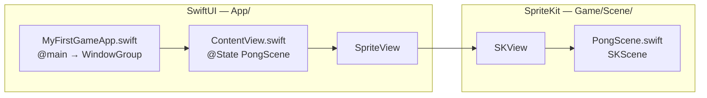
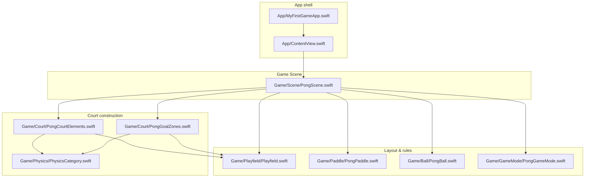

# MyFirstGame — file flow (current)

## Project layout

Swift sources are grouped under **`App/`** (shell) and **`Game/`** (one folder per entity). Asset catalogs stay next to them.

```
MyFirstGame/
  App/
    ContentView.swift
    GameHUDView.swift
    MyFirstGameApp.swift
    PongGameBridge.swift
  Game/
    Flow/PongFlowState.swift
    Ball/PongBall.swift
    Court/PongCourtElements.swift
    Court/PongGoalZones.swift
    GameMode/PongGameMode.swift
    Paddle/PongPaddle.swift
    Physics/PhysicsCategory.swift
    Playfield/Playfield.swift
    Rules/PongRules.swift
    Rules/PongMatchPhase.swift
    Rules/PongSide.swift
    Scene/PongScene.swift
  Assets.xcassets/
```

Two views: **runtime** (what runs when the app launches) and **code dependencies** (which Swift files reference which).

## 1. Runtime: from `@main` to the scene



**Sequence (conceptual):**

1. **`App/MyFirstGameApp.swift`** — Process entry (`@main`); builds the app’s scene and opens a window whose root is `ContentView`.
2. **`App/ContentView.swift`** — Creates **one** `PongScene` (stored in `@State`) and passes it to `SpriteView`.
3. **`SpriteView`** — Hosts an **`SKView`** and presents `PongScene`.
4. **`Game/Scene/PongScene.swift`** — `didMove(to:)` runs: configures the scene, physics world, adds court nodes, lays out paddles, touches, AI, scoring.

---

## 2. Dependencies: which files talk to which

`Playfield`, `PhysicsCategory`, `PongCourtElements`, `PongGoalZones`, `PongPaddle`, `PongBall`, and `PongGameMode` are not in the launch chain themselves; **`PongScene`** pulls them in when building and running the game.



| File | Role in this diagram |
|------|----------------------|
| `App/MyFirstGameApp.swift` | Entry → `WindowGroup` → `ContentView` |
| `App/ContentView.swift` | Owns `PongScene` instance → `SpriteView` |
| `Game/Scene/PongScene.swift` | Scene lifecycle, physics, HUD, AI, touch routing |
| `Game/Playfield/Playfield.swift` | Logical size and inner/outer Y bounds (no SpriteKit) |
| `Game/Paddle/PongPaddle.swift` | Paddle size, margin, sprite + physics |
| `Game/Ball/PongBall.swift` | Ball geometry + physics |
| `Game/Court/PongCourtElements.swift` | Walls + center line |
| `Game/Court/PongGoalZones.swift` | Goal sensors |
| `Game/Physics/PhysicsCategory.swift` | Physics category bitmasks |
| `Game/GameMode/PongGameMode.swift` | One player vs two players |

---

## 3. Preview path

Xcode **previews** skip `@main` and instantiate `ContentView()` directly; from there the flow is the same: `ContentView` → `SpriteView` → `PongScene`.
